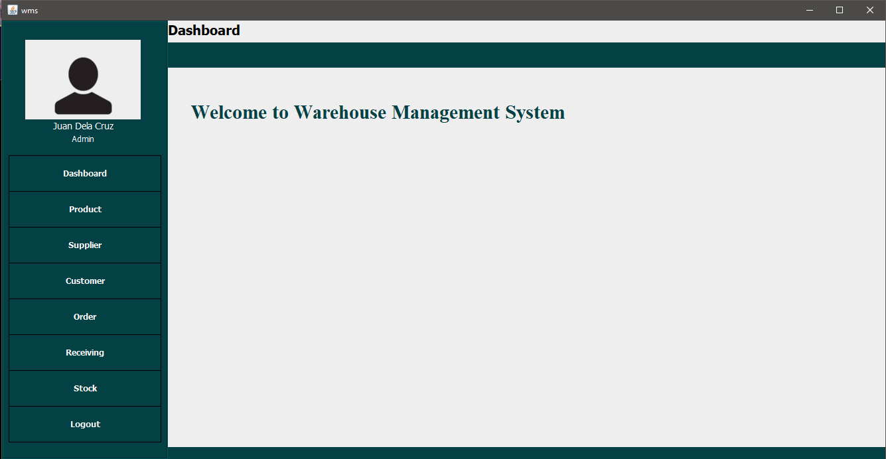

# Warehouse Management System

A Java CRUD Application for managing orders, receiving entries and storage of products in warehouses.

<br>

## Table of Contents
- [Overview](#overview)
- [Features](#features)
- [Requirements](#requirements)
- [Getting Started](#getting-started)
- [Usage](#usage)
- [License](#license)

## Overview

This application is created using java and swing library. It has basic function like Create,Read,Update and Delete. Also it is connected to MySQL server.
		
<br>

## Features

- User Authentication
- perform CRUD
- User-friendly interface using java swing library
- Print ❗
- Light-Dark Mode ❗
- Save as File ❗
- Real time Statistics ❗
- RBAC ❗
- search function ❗


> ❗ not yet implemented

<br>

## Requirements

- Java SE Development Kit (JDK) 8 or later
- MySQL Server
- Any java IDE

<br>

## Getting Started

1. Clone the repository: `git clone https://github.com/RovicAngelo/WMS.git`
2. Navigate to the project directory: `cd WMS`
3. Compile and run the application:

```bash
$ javac Main.java
$ java src/com/lanuza/wms/Main
```

<br>

## Usage
	
To use this application follow the guidelines.

<br>

<div style="display:flex;">
  <div style="flex:25%; padding-right: 10px;">
    <h3 style="color: #6DA4AA;">Login View</h3>
  <p  style="font-family: Verdana, sans-serif; text-align: justify;">
  In the login view, use the admin accounts provided for user authentication:<br><br>
  - <b>Admin 1</b>: <br>
  &nbsp;&nbsp;&nbsp;&nbsp;Username - <i>admin1</i>,<br>
  &nbsp;&nbsp;&nbsp;&nbsp;Password - <i>pass1</i> <br>
  - <b>Admin 2</b>:<br>
  &nbsp;&nbsp;&nbsp;&nbsp;Username - <i>admin2</i>,<br>
  &nbsp;&nbsp;&nbsp;&nbsp;Password - <i>pass2</i> <br>
  - <b>Admin 3</b>: <br>
  &nbsp;&nbsp;&nbsp;&nbsp;Username - <i>admin3</i>,<br>
  &nbsp;&nbsp;&nbsp;&nbsp;Password - <i>pass3</i>
</p>

  </div>
  <div style="flex:75%;">
    <p align="center">
      
    </p>
  </div>
</div>


<br><br>

<div style="display:flex;">
	<div style="flex:25%; padding-right: 10px;">
    <h3 style="color: #6DA4AA;">Login View</h3>
    <p  style="font-family: Verdana, sans-serif; text-align: justify;">
      The dashboard view serves as an overview page displaying key warehouse statistics and metrics. It provides a concise and visual representation of important information about the warehouse, such as inventory levels, order status, or any other relevant metrics.
    </p>
  </div>
  <div style="flex:75%;">
    <p align="center">
      
    </p>
  </div>
</div>

<br><br>

<div style="display:flex;">
	<div style="flex:25%; padding-right: 10px;">
    <h3 style="color: #6DA4AA;">Product View</h3>
    <p  style="font-family: Verdana, sans-serif; text-align: justify;">
      The product view is a section of the application where users can manage and view information related to products. This includes adding new products that will reflect to the stock and editing existing product details.
    </p>
  </div>
  <div style="flex:75%;">
    <p align="center">
      
    </p>
  </div>
</div>

<br><br>

<div style="display:flex;">
	<div style="flex:25%; padding-right: 10px;">
    <h3 style="color: #6DA4AA;">Supplier View</h3>
    <p  style="font-family: Verdana, sans-serif; text-align: justify;">
      The supplier view is where users can manage information about suppliers. It typically involves functionalities such as adding new suppliers, updating supplier details, and viewing a list of current suppliers.
    </p>
  </div>
  <div style="flex:75%;">
    <p align="center">
      
    </p>
  </div>
</div>

<br><br>

<div style="display:flex;">
	<div style="flex:25%; padding-right: 10px;">
    <h3 style="color: #6DA4AA;">Customer View</h3>
    <p  style="font-family: Verdana, sans-serif; text-align: justify;">
      The customer view allows users to manage customer information. This includes adding new customers and updating customer details.
    </p>
  </div>
  <div style="flex:75%;">
    <p align="center">
      
    </p>
  </div>
</div>

<br><br>
	
<div style="display:flex;">
  <div style="flex:25%; padding-right: 10px;">
    <h3 style="color: #6DA4AA;">Order View</h3>
    <p  style="font-family: Verdana, sans-serif; text-align: justify;">
      In the order view, users can manage and track orders. This includes creating new orders, updating order details, and viewing the status of existing orders.
    </p>
  </div>
  <div style="flex:75%;">
    <p align="center">
      
    </p>
  </div>
</div>

<br><br>

<div style="display:flex;">
  <div style="flex:25%; padding-right: 10px;">
    <h3 style="color: #6DA4AA;">Receiving View</h3>
    <p  style="font-family: Verdana, sans-serif; text-align: justify;">
      The receiving view is where users can manage the receiving process of goods or products. It involves functionalities such as confirming received shipments, updating inventory levels.
    </p>
  </div>
  <div style="flex:75%;">
    <p align="center">
      
    </p>
  </div>
</div>

<br><br>

<div style="display:flex;">
  <div style="flex:25%; padding-right: 10px;">
    <h3 style="color: #6DA4AA;">Stock View</h3>
    <p  style="font-family: Verdana, sans-serif; text-align: justify;">
      The stock view provides an overview of the current stock levels in the warehouse. It may include information about stock quantities, low stock alerts, and other metrics related to inventory management.
    </p>
  </div>
  <div style="flex:75%;">
    <p align="center">
      
    </p>
  </div>
</div>

<br><br>

<h3 style="color: #6DA4AA;">Logut</h3>

- The logout option is a feature that allows users to securely log out of the application. 

<br>

## Contributing

1. Fork the repository.
2. Create a new branch: `git checkout -b feature/new-feature`.
3. Commit your changes: `git commit -am 'Add some feature'`.
4. Push to the branch: `git push origin feature/new-feature`.
5. Submit a pull request.

> Desired contribution are as follow:
> - Printing function
> - Statistics in dashboard
> - Change modes(dark/light)
> - Save as file
> - RBAC
> - Search function

<br>

## License

This project is licensed under the MIT License - see the [LICENSE](https://opensource.org/license/mit/) file for details.
